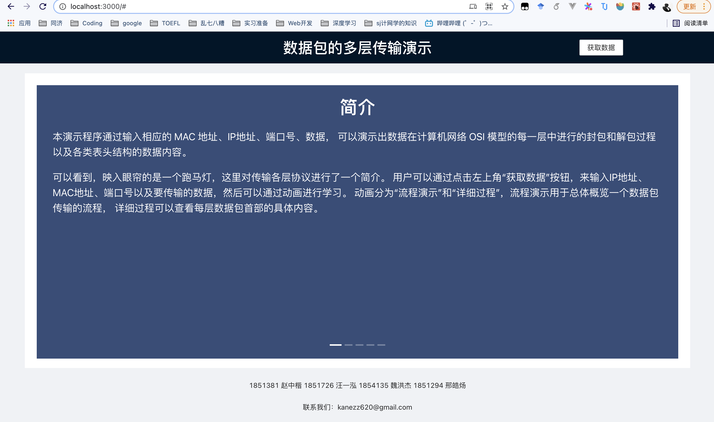
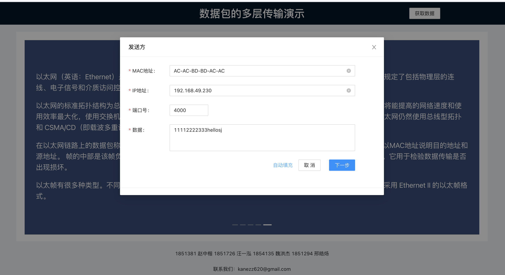
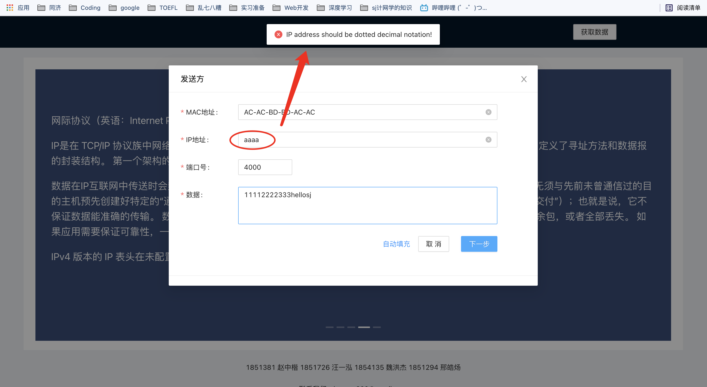
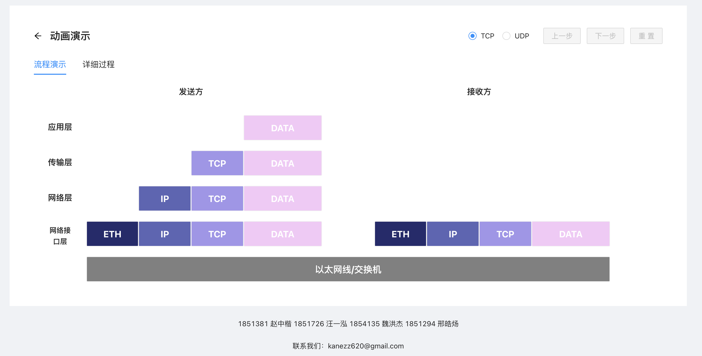
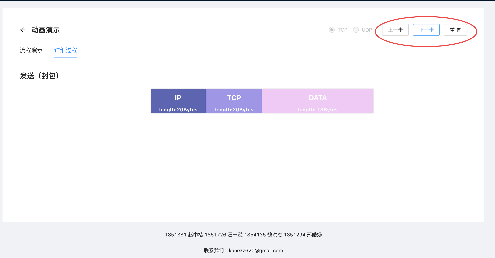
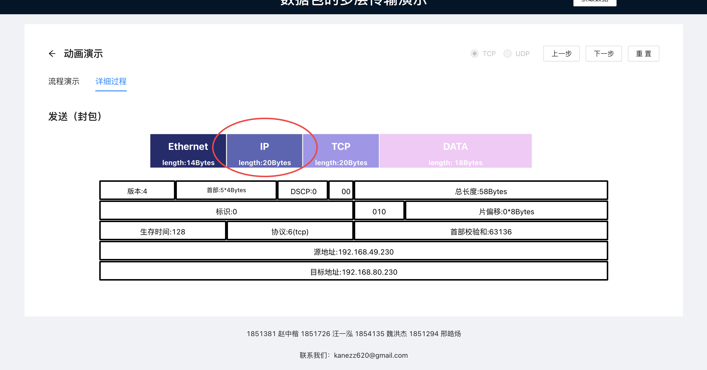
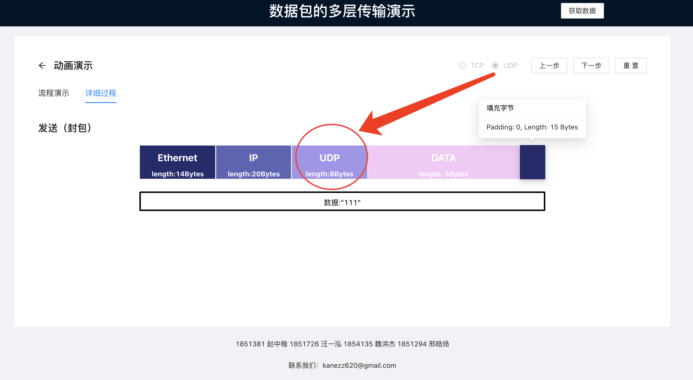

# 数据包多层传输演示

## 一、 本地运行过程

-   安装 [Node.js](https://nodejs.org/en/) ，LTS版本即可
-   安装yarn
    -   [根据不同操作系统，执行相应步骤](http://yarnpkg.top/Installation.html)
    -   执行`yarn --version`来确认是否安装成功

-   获取本项目
    -   运行`git clone https://github.com/KKZ20/TCP-UDP.git`拉取项目代码
    -   如果已经有这个项目代码了（比如查作业的可爱哥哥）则略过这一步

-   进入项目文件夹(`cd TCP-UDP`或者`cd TCP-UDP-master`，看你本地文件夹名字叫啥），安装依赖，按下面步骤依次执行
    -   执行`yarn add antd`安装Ant-Deisgn组件库依赖
    -   执行`npm install rc-queue-anim --save`安装Ant-Motion动画库依赖（进出场动画）
    -   执行`npm install rc-animate --save`安装Ant-Motion动画库依赖（css样式动画）
-   执行`yarn start`，即可在[本地3000端口]( [http://localhost:3000](http://localhost:3000/))查看！Enjoy it！

另外也可通过[在线访问](10.60.102.252:20129)来在线查看！

## 二、 程序设计总体说明

### 1. 总体目录结构

```
|--node_modules      // 项目工程使用的库，根据package.json安装，非常大，按照上面运行过程执行后可生成
   |--...
   `--...(多个文件不一一例举)
|--public            // 资源文件
   |--index.html     // 页面导航
   `--...(多个文件不一一例举)
|--src
   |--backend 2      // 各种协议头信息计算（重点关注！）
      |--Bridge.js   // 从页面获取数据，并传给各个协议头进行处理和计算
      |--Ethernet.js // 以太网头信息计算
      |--IP.js       // IP头信息计算
      |--TCP.js      // TCP头信息计算
      |--UDP.js      // UDP头信息计算
      `--test.js     // 测试用文件
   |--App.css            // 主页面样式
   |--App.js             // 主页面实现（重点关注！）
   |--App.test.js        // 工程创建时产生的文件
   |--index.css			 // 工程创建时产生的文件
   |--logo.svg           // 工程创建时产生的文件
   |--reportWebVitals.js // 工程创建时产生的文件
   `--setupTests.js      // 工程创建时产生的文件
|--.gitignore             // git提交时忽略追踪的配置
|--package-lock.json      // 项目使用依赖的配置文件（锁定所有模块的版本号）
|--package.json           // 项目使用依赖的配置文件（项目所使用的模块）
|--yarn.lock              // 扁平化展示项目使用依赖的配置文件
`--README.md              // You're now reading this!
```


### 2. 算法部分

关于数据包在 TCP/IP 四层协议中不断封装的过程的代码存放在 `/src/backend 2/` 目录下。

当输入一段数据后，程序首先将这段数据的内容由 ASCII 字符转换为二进制，然后根据 TCP/IP 协议自顶向下进行数据包的封装。

*   应用层：输入的数据转换成的二进制字符串。
*   传输层：在应用层内容的头部加上 TCP/UDP 首部，其中 TCP 首部总长 20 字节、UDP首部总长 8 字节。TCP 首部的内容设置在 `TCP.js` 文件中，定义了一个类 `TCPSegment` 用于生成一个 TCP 数据段；UDP 首部的内容设置在 `UDP.js` 文件中，定义了一个类 `UDPDatagram` 用于生成一个 UDP 数据报。二者在生成首部的时候都需要建立一个“IP 伪首部”以计算校验和。校验和的计算取 TCP/UDP 首部（包括IP伪首部），将每 16 位进行相加，并将加和中超出 16 位的内容右移 16 位后再与低 16 位进行相加，如此循环直至加和不超过 16 位，将此时的加和取反，得到结果。
*   网络层：在传输层内容的头部加上 IP 首部。本演示程序采用的是 IPv4 版本的首部，总长 20 字节，内容设置在 `IP.js` 文件中，定义了一个类 `IPv4Packet` 用于生成一个 IPv4 数据包。在生成数据包的过程中需要进行校验和的计算。 计算方法同传输层。
*   网络接口层：在网络层内容的头部加上以太网首部。本演示程序采用的是 Ethernet II 的以太网帧格式首部，总长 14 字节，内容设置在 `Ethernet.js` 文件中，定义了一个类 `EthernetFrame` 用于生成一个以太网帧。因为以太网帧的最小长度为 60 字节，若封包后的以太网帧长度仍不足 60 字节，则需在帧尾部进行 0 填充。另外，在以太网帧的尾部还有 FCS 校验和字段，采用 CRC32 算法进行该检验和的计算。

### 3. 界面演示部分

界面演示采用React框架以及Ant-Design、Ant-Motion等依赖，总体页面结构如下图：


有关具体实现请查看代码文件中的注释，此处不再赘述。


## 三、 使用说明

### 1. 总体操作流程图


### 2. 实例演示

-   按一中所说，打开界面（访问服务器or本地安装依赖+运行）
-   打开后映入眼帘的是一个概念简介，用户可在此查看有关本程序的简要使用说明以及各协议头的知识简介



-   点击右上角“获取数据按钮”，将弹出输入表单，用户在此进行发送方/输入方的MAC地址、IP地址和端口号，以及要传输的数据。用户也可以通过点击自动填充，来自动填写默认数据



-   当用户输入数据格式有误时会给出反馈，包括未输入数据、输入格式有误、不合法范围等（例：IP地址输入有误）



-   输入好数据后，用户即可看到一个数据包在多层协议传输的流程，这里为连续动画



-   用户可以点击“详细过程”页，来进行单步操控（上一步、下一步、重置）



-   点击具体的协议头/数据块，即可查看详细信息



-   另外我们还对TCP/UDP的切换以及填充字节进行了支持

    

-   用户可以随时点击左上角返回按钮返回首页（概念介绍），或在此点击获取数据更改数据（动画不会重新演示，但各协议头详细内容会相应改变）
-   使用愉快！
